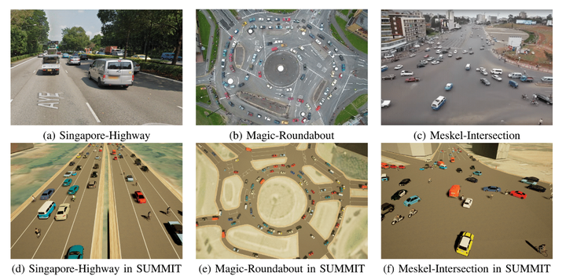

SUMMIT Simulator
===============

Getting started
--------------

If you are simply looking to use SUMMIT, follow the set up instructions [here](https://adacompnus.github.io/summit-docs/getting_started/setting_up/).

If you are a developer looking to modify SUMMIT, follow the build instructions [here](https://adacompnus.github.io/summit-docs/getting_started/building/) instead.

To access the expert planner, visit the planner repository [here](https://github.com/AdaCompNUS/context-pomdp).

**All tutorials and references are available at our [main documentation website](https://adacompnus.github.io/summit-docs).**

What's SUMMIT?
--------------



SUMMIT (Simulator for Urban Driving in Massive Mixed Traffic) is an open-source simulator with a focus on generating high-fidelity, interactive data for unregulated, dense urban traffic on complex real-world maps. It works with map data in the form of OSM files and SUMO networks to generate crowds of heterogeneous traffic agents with sophisticated and realistic unregulated behaviors. SUMMIT can work with map data fetched from online sources, providing a virtually unlimited source of complex environments.

SUMMIT additionally exposes interfaces to interact with the contextual information provided by the map data. It also provides a robust suite of geometric utilities for use by external programs. Through these, SUMMIT aims to enablie applications in a wide range of fields such as perception, vehicle control and planning, end-to-end learning, etc.

SUMMIT was built upon the very successful CARLA. Updates to CARLA are constantly merged into SUMMIT to ensure that users of SUMMIT have access to the high quality of work endowed by CARLA, such as its high-fidelity physics, rendering and sensors; however, it should be noted that not all components of SUMMIT work with those from CARLA, as they were designed for a different use case.

Check out our video [here](https://youtu.be/dNiR0z2dROg)!

Paper
-----

If you use SUMMIT, please cite our ICRA’2020 paper.

_SUMMIT: A Simulator for Urban Driving in Massive Mixed Traffic_<br>Panpan Cai, Yiyuan Lee,
Yuanfu Luo, David Hsu; 2020 IEEE International Conference on Robotics and Automation (ICRA).
[[PDF](https://arxiv.org/abs/1911.04074)]


```
@inproceedings{cai2020summit,
  title={SUMMIT: A Simulator for Urban Driving in Massive Mixed Traffic},
  author={Cai, Panpan and Lee, Yiyuan and Luo, Yuanfu and Hsu, David},
  booktitle={2020 IEEE International Conference on Robotics and Automation (ICRA)},
  pages={4023--4029},
  year={2020},
  organization={IEEE}
}
```

License
-------

SUMMIT and CARLA specific code are distributed under MIT License.

SUMMIT and CARLA specific assets are distributed under CC-BY License.

The ad-rss-lib library compiled and linked by the [RSS Integration build variant](Docs/rss_lib_integration.md) introduces LGPL-2.1-only License.

The earcut library is distributed under ISC License.

The Libosmium library is distributed under Boost Software License - Version 1.0.

Note that UE4 itself follows its own license terms.
